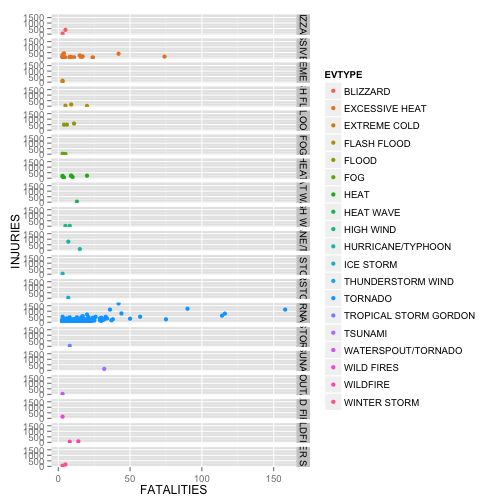
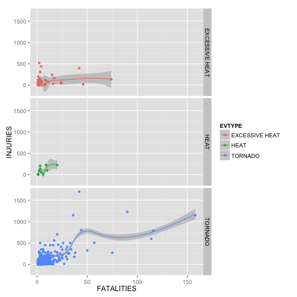

# IMPACT OF TORNADOS, HEAT ETC. ON PUBLIC HEALTH AND THE US ECONOMY
Which event types (tornados, floods, heat etc.) are most harmful in respect to public health and the US economy?

## SYNOPSIS    
Synopsis: Immediately after the title, there should be a synopsis which describes and summarizes your analysis in at most 10 complete sentences.
QUESTIONS
1. Across the United States, which types of events (as indicated in the EVTYPE variable) are most harmful with respect to population health?
2. Across the United States, which types of events have the greatest economic consequences?


## ASSIGNEMENT
This project involves exploring the U.S. National Oceanic and Atmospheric Administration's (NOAA) storm database. This database tracks characteristics of major storms and weather events in the United States, including when and where they occur, as well as estimates of any fatalities, injuries, and property damage.
Consider writing your report as if it were to be read by a government or municipal manager who might be responsible for preparing for severe weather events and will need to prioritize resources for different types of events. However, there is no need to make any specific recommendations in your report.


## DATA PROCESSING
The [Storm Data, zip, 47Mb]("https://d396qusza40orc.cloudfront.net/repdata%2Fdata%2FStormData.csv.bz2") as well as the [National Weather Service Storm Data Documentation, PDF]("https://d396qusza40orc.cloudfront.net/repdata%2Fpeer2_doc%2Fpd01016005curr.pdf") and the [National Climatic Data Center Storm Events FAQ]("https://d396qusza40orc.cloudfront.net/repdata%2Fpeer2_doc%2FNCDC%20Storm%20Events-FAQ%20Page.pdf") explaining the data have been downloaded. 

To explore the storm data, we use the programming language R on an Apple computer as can be seen in the Session Info below.
We use read.csv to load the zipped data and create the stormdata data frame. The data frame has 902'297 observations and 37 variables.


```r
## rm(list=ls())
## setwd("/Users/rogerfischer/datasciencecoursera/repdata/RepData_PeerAssessment2")

## sessionInfo()
## R version 3.1.2 (2014-10-31)
## Platform: x86_64-apple-darwin13.4.0 (64-bit)

## locale:
## [1] en_US.UTF-8/en_US.UTF-8/en_US.UTF-8/C/en_US.UTF-8/en_US.UTF-8

## attached base packages:
## [1] stats     graphics  grDevices utils     datasets  methods   base     

## other attached packages:
## [1] ggplot2_1.0.0 dplyr_0.4.1   knitr_1.9   

## Storm Data, 47Mb, zipped with bzip2 algorithm
download.file("https://d396qusza40orc.cloudfront.net/repdata%2Fdata%2FStormData.csv.bz2", "StormData.csv.bz2", method="curl")
## read.csv can read zipped files directly
stormdata <- read.csv("StormData.csv.bz2")

## Early Exploration
dim(stormdata)
```

```
## [1] 902297     37
```

```r
## summary(stormdata$EVTYPE)
summary(stormdata$FATALITIES)
```

```
##     Min.  1st Qu.   Median     Mean  3rd Qu.     Max. 
##   0.0000   0.0000   0.0000   0.0168   0.0000 583.0000
```

```r
class(stormdata$FATALITIES)
```

```
## [1] "numeric"
```

```r
sum_fatalities <- sum(stormdata$FATALITIES)
sum_fatalities
```

```
## [1] 15145
```

```r
summary(stormdata$INJURIES)
```

```
##      Min.   1st Qu.    Median      Mean   3rd Qu.      Max. 
##    0.0000    0.0000    0.0000    0.1557    0.0000 1700.0000
```

```r
class(stormdata$INJURIES)
```

```
## [1] "numeric"
```

```r
sum_injuries <- sum(stormdata$INJURIES)
sum_injuries 
```

```
## [1] 140528
```


## HARMFUL EVENTS (INJURIES, FATALITIES)
As we want to answer the question: "Across the United States, which types of events (as indicated in the EVTYPE variable) are most harmful with respect to population health?", we first  create a subset of the data by selecting all events which have fatalities or injuries greater than zero. We already know that the total of all injuries is 140'528 and the total of all fatalities is 15'145.


```r
harmful <- subset(stormdata, stormdata$FATALITIES > 0 & stormdata$INJURIES > 0)
dim(harmful)
```

```
## [1] 2649   37
```

Then we filter out only the three columns needed to answer the question. Tornado looks immediately like a category with a lot of fatalities and injuries.


```r
harmful_small <- harmful[, c("BGN_DATE", "EVTYPE", "FATALITIES", "INJURIES")]
summary(harmful_small)
```

```
##               BGN_DATE               EVTYPE       FATALITIES     
##  4/3/1974 0:00:00 :  65   TORNADO       :1378   Min.   :  1.000  
##  4/11/1965 0:00:00:  37   LIGHTNING     : 263   1st Qu.:  1.000  
##  4/27/2011 0:00:00:  33   TSTM WIND     : 148   Median :  1.000  
##  3/21/1952 0:00:00:  21   FLASH FLOOD   :  85   Mean   :  2.862  
##  2/5/2008 0:00:00 :  14   HIGH WIND     :  69   3rd Qu.:  2.000  
##  5/31/1985 0:00:00:  13   EXCESSIVE HEAT:  64   Max.   :158.000  
##  (Other)          :2466   (Other)       : 642                    
##     INJURIES      
##  Min.   :   1.00  
##  1st Qu.:   2.00  
##  Median :   5.00  
##  Mean   :  29.82  
##  3rd Qu.:  20.00  
##  Max.   :1700.00  
## 
```

```r
## Tornado Subset
harmful_tornado <- subset(harmful_small, EVTYPE == "TORNADO")
dim(harmful_tornado)
```

```
## [1] 1378    4
```

```r
summary(harmful_tornado)
```

```
##               BGN_DATE                      EVTYPE       FATALITIES     
##  4/3/1974 0:00:00 :  65   TORNADO              :1378   Min.   :  1.000  
##  4/11/1965 0:00:00:  37      HIGH SURF ADVISORY:   0   1st Qu.:  1.000  
##  4/27/2011 0:00:00:  33    COASTAL FLOOD       :   0   Median :  2.000  
##  3/21/1952 0:00:00:  21    FLASH FLOOD         :   0   Mean   :  3.793  
##  2/5/2008 0:00:00 :  13    LIGHTNING           :   0   3rd Qu.:  3.000  
##  5/31/1985 0:00:00:  13    TSTM WIND           :   0   Max.   :158.000  
##  (Other)          :1196   (Other)              :   0                    
##     INJURIES      
##  Min.   :   1.00  
##  1st Qu.:   5.00  
##  Median :  13.00  
##  Mean   :  43.68  
##  3rd Qu.:  40.00  
##  Max.   :1700.00  
## 
```

```r
tornado_fatalities <- sum(harmful_tornado$FATALITIES)
tornado_fatalities
```

```
## [1] 5227
```

```r
tornado_injuries <- sum(harmful_tornado$INJURIES)
tornado_injuries
```

```
## [1] 60187
```

Tornado is definitely one of the more harmful event types, as evidenced by the fatalities, 5'227 of 15'415 total, and the injuries, 60'187 from total 140'528. Next to that others will pale in comparison. We will now look at event types with fatalities and injuries higher then the 3rd quartile and higher as the mean, as seen in summary(harmful_small). 


```r
# over the 3rd quartile
harmful_4qu <- subset(harmful_small, FATALITIES > 2 & INJURIES > 20)
dim(harmful_4qu)
```

```
## [1] 377   4
```

```r
harmful_evtypes <- unique(harmful_4qu$EVTYPE)
harmful_evtypes
```

```
##  [1] TORNADO               WILD FIRES            TROPICAL STORM GORDON
##  [4] BLIZZARD              WATERSPOUT/TORNADO    EXCESSIVE HEAT       
##  [7] HEAT                  HEAT WAVE             EXTREME COLD         
## [10] HIGH WIND             WINTER STORM          ICE STORM            
## [13] FOG                   FLASH FLOOD           FLOOD                
## [16] WILDFIRE              HURRICANE/TYPHOON     TSUNAMI              
## [19] THUNDERSTORM WIND    
## 985 Levels:    HIGH SURF ADVISORY  COASTAL FLOOD ... WND
```

```r
# over the mean
harmful_mean <- subset(harmful_small, FATALITIES > 2.862 & INJURIES > 29.82)
dim(harmful_mean)
```

```
## [1] 338   4
```

```r
harmful_evtypes2 <- unique(harmful_mean$EVTYPE)
harmful_evtypes2
```

```
##  [1] TORNADO               WILD FIRES            TROPICAL STORM GORDON
##  [4] BLIZZARD              WATERSPOUT/TORNADO    EXCESSIVE HEAT       
##  [7] HEAT                  HEAT WAVE             EXTREME COLD         
## [10] HIGH WIND             WINTER STORM          ICE STORM            
## [13] FLASH FLOOD           FLOOD                 FOG                  
## [16] WILDFIRE              HURRICANE/TYPHOON     TSUNAMI              
## [19] THUNDERSTORM WIND    
## 985 Levels:    HIGH SURF ADVISORY  COASTAL FLOOD ... WND
```

We know have 19 event types that remain. Plotting can help to get a better picture.


```r
library(ggplot2)
qplot(x = FATALITIES, y = INJURIES, data = harmful_4qu, facets = EVTYPE ~ . ,  color = EVTYPE, geom =   c("point"))
```

 

The 3 most harmful events types are:   
- Tornados    
- Excessive Heat    
- Heat    

```r
most_harmful <- subset(harmful_small, EVTYPE == "TORNADO" | EVTYPE == "EXCESSIVE HEAT" | EVTYPE == "HEAT")
qplot(x = FATALITIES, y = INJURIES, data = most_harmful, facets = EVTYPE ~ . ,  color = EVTYPE, geom =   c("point"))
```

 

## RESULTS
There should be a section titled Results in which your results are presented.


